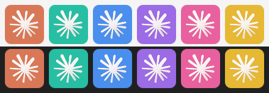

# Claude Switcher

**Switch the Claude desktop app between your accounts with one key — and keep the same Code sessions on every account.**

<p>
  <br>
  
</p>

`⌘ Page Down` → the running account quits, the next one opens already logged in, and the sidebar shows the same sessions as before.
No logging out, no logging in, no second copy of your work.

[한국어 README](README.ko.md)

> Unofficial community tool. Not affiliated with or endorsed by Anthropic. macOS, plus Windows (experimental).

---

## The idea in three facts

Claude Switcher does not hack the app. It only arranges three things the app already does:

1. **Every data folder keeps its own login.** The desktop app can be started with a different data folder
   (`--user-data-dir`). Each folder remembers the account that logged in there. So one folder per account =
   every account stays logged in.
2. **Conversations are already shared.** Code-tab transcripts live in `~/.claude/projects`, one place for every
   account. What is *not* shared is the sidebar list, which the app keeps per account:
   `<data folder>/claude-code-sessions/<account>/<org>/`.
3. **So we keep those lists identical.** A small background job copies session-list changes between the
   account folders within seconds. Only one account runs at a time, so they never write at once.

<p align="center"></p>

Switching is then just: *quit the running account → sync once → open the next account's data folder.*

## What you get

| | |
|---|---|
| **⌘ Page Down** | Switch to the next account (A → B → C … → A) from anywhere. |
| **Menu bar** | The Claude symbol, in each account's own colour, shows which account is running. The menu lists every account. |
| **`claude-switch`** | The same thing from a terminal or from inside a Claude session. |
| **Busy check** | If a session is still working, you get *"There are N session(s) still working. Switch anyway?"* first. |
| **Any number of accounts** | `claude-switch add` adds C, D, … Each gets its own colour. |
| **Opens the account you used last** | The Dock icon, a login item or a reboot always open the default account (A). If you last used another one, Claude Switcher reopens that one right away. Turn off with `"restore_last": false` in `~/.config/claude-switcher/config.json`. |

<p align="center"></p>

The menu bar symbol is taken at runtime from **your own installed** `/Applications/Claude.app` icon and tinted;
this repository ships no Anthropic artwork. If it cannot be read, a drawn star is used instead.

## Install

Requirements: macOS, the Claude desktop app in `/Applications`, Xcode Command Line Tools (`xcode-select --install`).

```bash
git clone https://github.com/beyondworks/claude-switcher.git
cd claude-switcher
./install.sh
```

The installer puts `claude-switch` in `~/.local/bin`, builds the menu bar app into `~/Applications`,
starts it at login, and detects your current account's session folder.

### Windows (experimental)

Requirements: Windows 10/11, the Claude desktop app from [claude.ai/download](https://claude.ai/download)
(the per-user installer), Python 3 (`winget install Python.Python.3.12`). Download
`claude-switcher-<version>.zip` from the [latest release](https://github.com/beyondworks/claude-switcher/releases/latest),
unzip it, and in that folder run:

```powershell
powershell -ExecutionPolicy Bypass -File windows\install.ps1
```

You get the same three ways to switch: **Ctrl + Alt + Page Down** (plain Ctrl + Page Down is the browser's
next-tab key), a tray icon in each account's colour, and `claude-switch` in a new terminal. There is no launchd
on Windows, so the tray app also runs the sync every 20 seconds. Adding accounts works the same way
(tray icon → **Add account…**).

<p align="center"></p>

### Add an account (once per account)

Menu bar → **Add account…**, or in a terminal:

```bash
claude-switch add Personal     # opens a new Claude window with its own data folder
```

Log in there once and open the **Code** tab once. The menu bar app notices the new account's session folder
within about 15 seconds, starts syncing it and adds it to the menu. New accounts are named C, D, E … and each
gets its own colour. (Without the menu bar app: `claude-switch setup`.)

> **Google sign-in gotcha.** While another Claude window is open, the browser hands the Google sign-in back to
> *that* window, which ignores it. Use **email sign-in** in the new window, or quit the other Claude window
> while you sign in. This is needed only the first time — the login is saved in that account's folder.

Name your accounts (shown in the menu):

```bash
claude-switch label a Work
claude-switch label b Personal
```

## Use

```bash
claude-switch            # next account
claude-switch b          # a specific account
claude-switch status     # which one is running
claude-switch profiles   # list accounts
claude-switch doctor     # check folders and the sync job
```

## What is shared and what is not

| Shared across accounts | Not shared |
|---|---|
| Code-tab session list (titles, archive state, deletions) | claude.ai web chats (stored per account on Anthropic's servers) |
| Conversation transcripts (`~/.claude/projects`) | Cowork / local-agent sessions |
| Routines stored with the session list | Usage limits and billing — each account has its own |
| Desktop app settings: desktop MCP servers, preferences, starred sessions and session groups, trusted folders, Code-tab worktree records, MCP tool toggles (merged at every switch) | claude.ai connectors (Gmail, Notion, …) — connect them in each account |
| Everything in `~/.claude`: `CLAUDE.md`, rules, skills, plugins, hooks, MCP servers in `~/.claude.json`, memory | Plugins the app installs per organization (Cowork plugins) — install them once at user level (`claude plugin install …`) to have them everywhere |
| | The login itself (`config.json`, cookies) — kept per folder on purpose |
| | **Prompt cache** — caches are isolated per organization, so the first message after switching re-reads the conversation without a cache and uses more of that account's quota |

## Safety

- **Nothing is deleted outright.** A session removed on one account is moved to
  `~/Library/Application Support/claude-switcher/trash/<date>/` (Windows: `%LOCALAPPDATA%\claude-switcher\trash\`) on the others.
- **Mass-delete guard.** If one sync would remove more than 20% of all files (and more than 5), it stops and logs instead.
- **Real folders only.** The app refuses to save into a session folder that is a symlink (it opens it with `O_NOFOLLOW`),
  so Claude Switcher never links folders; it copies.
- **One account at a time.** Switching refuses to run if more than one account is open, and never force-quits the app
  (it waits up to 30 s for a normal quit). On Windows, closing the window only hides Claude in the tray, so Claude
  Switcher sends the same "session ending" message Windows sends at sign-out; the app then quits normally.
- A change made in the last few seconds before a switch may not have synced yet; the switch runs one extra sync to catch it.
- **Settings are merged only while Claude is closed** (the app rewrites them from memory while it runs), so every switch
  merges them between quitting one account and opening the next. Three-way merge against the last result: what one
  account added, changed or removed reaches the others; if two changed the same value, the newer file wins.
  `claude-switch share` does it by hand.

## Uninstall

```bash
./uninstall.sh                                                       # macOS
powershell -ExecutionPolicy Bypass -File windows\uninstall.ps1       # Windows
```

Removes the programs and background jobs. Your Claude data folders, logins and sessions are left as they are.

## Limitations

- **Windows is experimental.** CI checks it on a real Claude install: switching A → B → A, a normal quit of each
  account, folder detection and the tray app's sync. What CI cannot check, because it has no logged-in account:
  switching while logged in, the busy-session prompt, and the tray menu and hotkey themselves. Reports are welcome.
  The Microsoft Store (MSIX) version of Claude is not supported yet.
- Relies on the desktop app's current folder layout and log format. An app update could change them; `claude-switch doctor`
  will show it.
- Using several accounts is subject to Anthropic's terms. Check the [usage policy](https://www.anthropic.com/legal/aup)
  and [consumer terms](https://www.anthropic.com/legal/consumer-terms) for your plan.

## Development

```bash
python3 -m unittest discover tests      # sync engine and folder detection
swiftc -O menubar/main.swift -o /tmp/ClaudeSwitcher
# Windows tray app: C:\Windows\Microsoft.NET\Framework64\v4.0.30319\csc.exe (see windows/install.ps1)
```

Releases are made by pushing a tag: `git tag v0.1.0 && git push origin v0.1.0`.

## License

MIT
